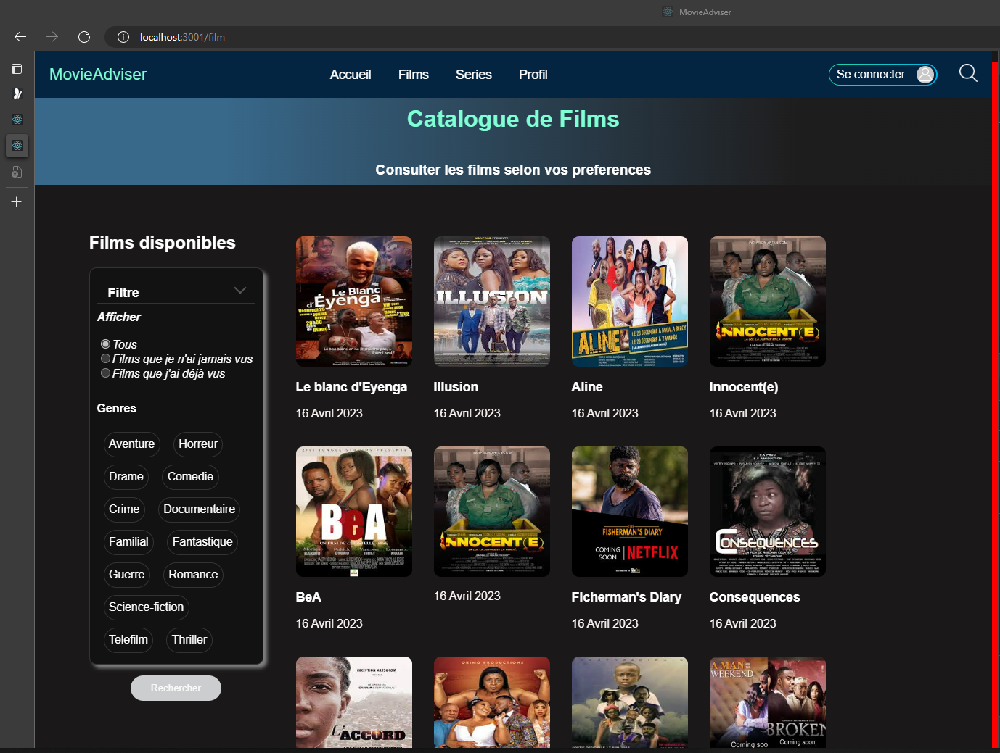

#  Projet de conception d'un systeme de recommandation de contenus basé sur l'intelligence artifcielle

Notre projet consiste en la production d'un algoritheme de recommandation de contenus basé sur l'utilisation d'algorithe de'intelligence artificielle et deployé sur le web à travers un site web  
    
<h2>Table de matière</h2>
<ul>
<li><a href="#">Description</a></li>
<li><a href="#">Approche utiliséé</a></li>
<li><a href="#">Processus Backend</a></li>
<li><a href="#">Presentaion de l'interface</a></li>
<li><a href="#">Installation et utilisation du site</a></li>
<li><a href="#">Crédits</a></li>
</ul>
 

<ol>
    <li style="color: red;"><h3>Description du projet</h3></li> 
    <strong style="color: blue;">Comment fonctionne t-il?</strong> 
        Grace aux diverses informations de l'utilisateurs de l'application ainsi que des donnnées que nous disposons , nous entrainons un modele d'intelligence artificielle que tient en compte les preferences de l'utilisateur qinsi que 
        ceux des personnes(autres utilisateurs) ayant des similarités de gout avec celui-ci.  
        Les données recoltées de l'utilisateurs sont enregistré dans notre base de données pour etres utilisées à leur tour pour servir premierement à la personnalisation des recommandation et 
        deuxiemement à la recommandation d'autres utilisateurs ayant des similarités avec lui.
    <li style="color: red;"><h3>Description de l'approche utilisée</h3></li> 
    <strong style="color: blue;">Architecture de notre projet</strong> 
     
    <strong style="color: blue;">Description de l'architecture</strong> 
    
Le projet se focalise sur 3 principaux point:
        <ul>
            <li style="font-weight: 800;  list-style: square;color: rgb(5, 98, 126);">La recolte continu de données</li>: Nous avons créer des algorithmes chargés de collecter des données utilisateurs lors de leur connection à l'application.
            <li style="font-weight: 800;  list-style: square;color: rgb(5, 98, 126);">Le traitement des données</li>: Ici nous construisons des algorithmes permettant de traiter les données du datasets et des données des utilisateurcollecter sur l'interface afin de les mettre sous un format adequate pour le l'entrainement du modèle d'IA ainsi que la construction des differentes bases de données.
            <li style="font-weight: 800;  list-style: square;color: rgb(5, 98, 126);">La construction du modeles d'IA</li>/ ici il s'agit de construire le modeles d'IA capable de faire les recommandations de produit eux differents utilisateurs en tenant compte de leur preference. Le modeles se base sur deux principes: Le filtrag collaboratif, qui donnes des recommandations en tenant compte des smilarités de gout entre utilisateurs et 
            le filtrage de contenus qui tient compte de la popularite d'un produits par rapport aux prefernce de l'utilisateur pour ces recommandations.
        </ul>
    

    <li style="color: red;"><h3>Description du processus backend </h3></li> 
    
 Le processus de recommandation est basé sur 2 points clés : Le pretraitement de données et la recommandation par le modeles d'IA, tous les deux codés en python.

    <UL>
        <li style="color: rgb(0, 156, 255);"><h3>Les algorithmes de pretraitement des donneés :</h3></li> 
        Les alogorithemes de pretraitement de données premettent de metre en forme les données recoltée pour l'entrainement du modeles d'IA.
        En python, dans un pipeline de pretraitement prealablement  cré, nous construisons successivement des algorithe permettant de mettre à jour, nettoyer, analyser et encoder les données suivant des normes etablies dans le cahier de charge pour pouvoir affiner les recommanadation.  
        <strong>Comment cela se passe?</strong> 
        Une fois les données recoltées et constituant notre dataset, nous trions les données obsolètes, nous effacons les donneés non-necessaires à la conception de notre modele, nous standardisons les données puis nous creons les porgramme permettant de faire un analyse sentiment pour les données de types textes.
        Apres cela nous nettoyons et analysons les données de notre datasets nettoyé pour l'encodage de ceux-ci.  
        Une fois cela terminer, nous enregistrons les données utiles à notre algorithme dans des bases de données pour une meilleur utilisation lors de la recolte des données utilisateur.  
        <li style="color: rgb(0, 156, 255);">Le modèle d'IA:</li> 
        Le modele d'IA se focalise pincipalement sur les preference de l'utilisateur concerné par la recommandation. C'est à dire que le systeme ne recommnade que les rpoduits susceptibles de plaire à l'utilisateur en fonction des données recoltées.  
        <strong>Comment ça marche?</strong> 
        Une fois l'utilisateur connecté , il lui est demandé d'entrrer ses preferences ou de les choisir parmis un collection d'articles proposés.  
        premierement, les données collectées de l'utislisateur sont analysées et traiter par les algorithmes de pretraitement des données et stocker dans des bases de données pour l'entrainement du modèle d'IA.Ensuite, nous utilisons le principe
    </UL>
</ol>
<h2>Interface utilisateur du site web</h2>
 

  <h2 font-color = "red">Installation et utilisation du projet</h2>
  <h3><li>Avec Docker</li></h3>
  <h3><li>Avec l'invite de commande </li></h3>

  <h2 font-color = "red">Crédits</h2>
	<h3>Langages utilisés</h3>
	

		
  		
		
		
		
	

 <h3>Me contacter</h3>
 

	 
	 
	 
	 
 

	

